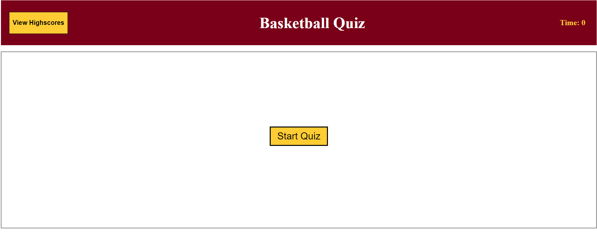
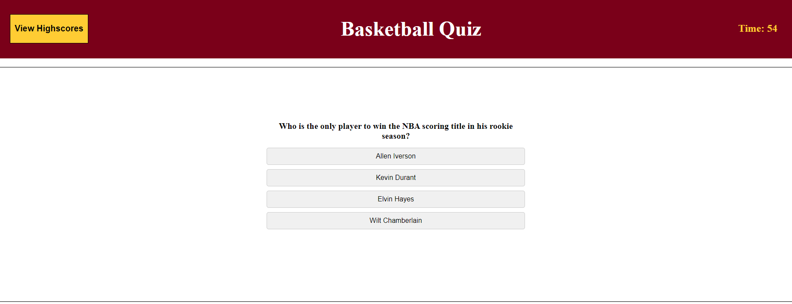
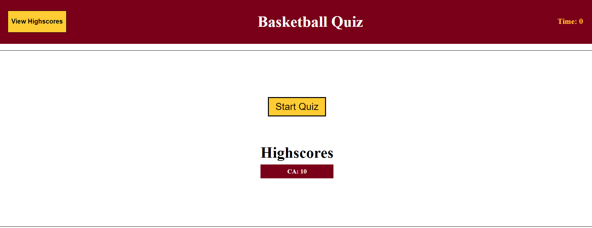

# NBA Basketball Quiz 

This is a NBA Basketball quiz game that you can play to sharpen your NBA knowledge. It presents multiple-choice questions about various NBA topics, including players, teams, records, and achievements. Users have to try and beat the clock with correct answer awarding 5 seconds and incorrect answers penalizing 5 seconds. Each correct answer awards 1 point.

## Features

- Multiple-choice questions: The quiz presents a series of multiple-choice questions about basketball.
- Randomized questions: The questions are randomized each time the quiz is taken, providing a different experience in each session.
- Timer: The quiz includes a countdown timer that limits the time available to answer each question.
Scoring: Users earn points for each correct answer, and their final score is displayed at the end of the quiz.
- Highscores: Users can save their scores along with their initials and view the highscores achieved by different players.

## Technologies Used

- HTML: Used to structure the quiz interface.
- CSS: Used for styling the quiz and creating an attractive user interface.
- JavaScript: Used for quiz logic, question randomization, scoring, and timer functionality.
- Local Storage: Used to store and retrieve highscores data on the user's device.

## Screenshots

